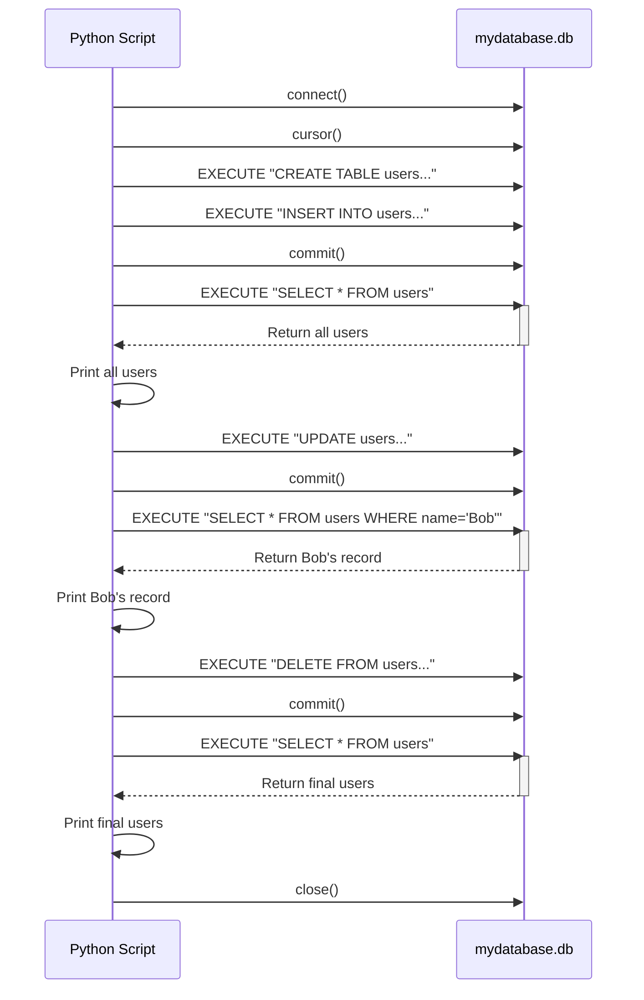

# SQL with Python - A Beginner's Guide

A simple, beginner-friendly introduction to using SQL (Structured Query Language) with Python. This repository demonstrates the basics of database operations using Python's built-in `sqlite3` library.

## Project Contents

- **`sql_tutorial.py`**: Python script demonstrating basic SQL operations (CREATE, INSERT, SELECT, UPDATE, DELETE)
- **`SQL_INTRO.md`**: Comprehensive guide explaining SQL concepts and Python database interactions
- **`mydatabase.db`**: Sample SQLite database created by running the script
- **`README.md`**: This file, providing an overview of the repository

## What You'll Learn

- How to connect to a SQLite database from Python
- Creating tables and defining their structure
- Adding, retrieving, updating, and deleting data
- Understanding the key differences between SQL databases and JSON
- Viewing and editing SQLite databases with external tools

## Getting Started

### Prerequisites

- Python 3.x (any recent version)
- No external libraries required! Everything used is in Python's standard library.

### Running the Example

1. Clone this repository:
   ```
   git clone [your-repo-url]
   cd SQL_1
   ```

2. Run the Python script:
   ```
   python sql_tutorial.py
   ```

3. Observe the output to see the SQL operations in action.

4. To view the database file (`mydatabase.db`), we recommend using [DB Browser for SQLite](https://sqlitebrowser.org/).

## Script Flowchart

The following sequence diagram illustrates the interaction between the `sql_tutorial.py` script and the `mydatabase.db` file:



## Further Learning

For a complete explanation of all the SQL concepts used in this project, see the `SQL_INTRO.md` file included in this repository. It provides a detailed, beginner-friendly breakdown of:

- Why use SQL instead of JSON files
- SQL query syntax and operations
- How Python's `sqlite3` module works
- Ways to view and interact with SQLite database files

## License

This project is licensed under the MIT License - see the LICENSE file for details.

## Acknowledgments

- This project was created as a beginner-friendly introduction to SQL with Python.
- SQLite official documentation: [sqlite.org](https://www.sqlite.org/docs.html)
- Python `sqlite3` library documentation: [Python docs](https://docs.python.org/3/library/sqlite3.html)
